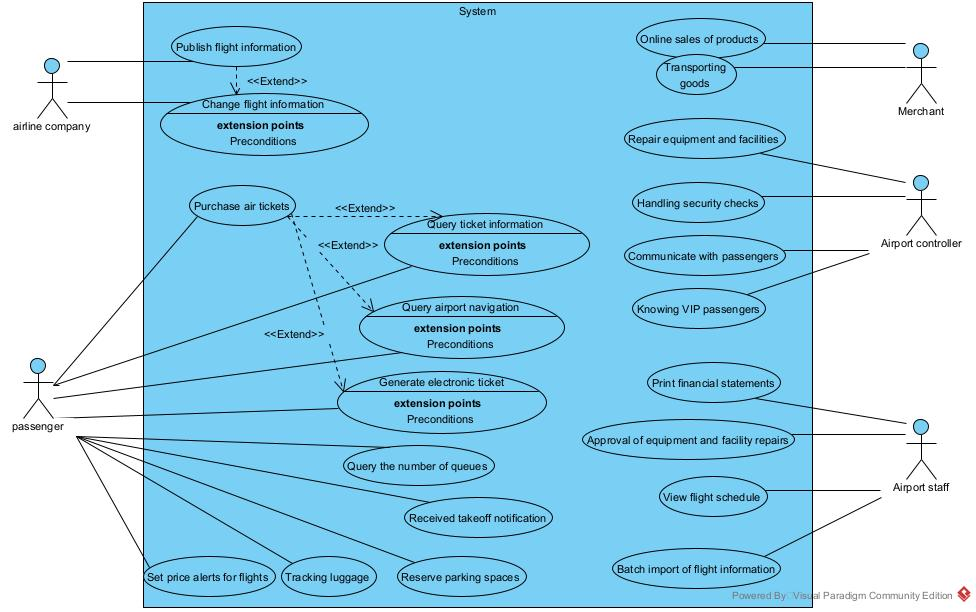

# 软件需求规格说明书

## 第一章 引言

### 1.1 编写目的

本软件需求规格说明书的编写目的主要为：

1. 该软件为智能机场系统，主要目的为实现一个能够智能调度跑道资源，为航空公司、旅客、机场工作人员乃至使用飞机的商户提供便利的机场系统。
2. 该软件需求规格说明书的主要目标受众包括：开发人员、用户、审查人员等
3. 本软件需求规格说明书主要目的为进一步详细而客观的描述该软件需要实现的各种需求，并对如何实现这些需求进行初步的设计

### 1.2 描述范围

该软件为智能机场系统，主要的应用场景为在机场智能调度跑道资源，主要的目标是在限定跑道数目的情况下，在保证安全的情况下实现对航空公司发布的航班信息的智能调度，提升机场的效率。该软件主要优势在于可以自动对发布的信息进行审查，并为用户提供了良好的信息查询接口。

### 1.3 名词定义

| 名词名称     | 定义内容                                                   |
| ------------ | ---------------------------------------------------------- |
| 旅客         | 使用本系统购买机票的用户                                   |
| 航空公司     | 在本系统上发布航班信息的公司                               |
| 机场工作人员 | 在机场工作的相关人员，包括管理者与客服、保安等普通工作人员 |
| 商户         | 在机场入驻的商家                                           |

### 1.4 参考资料

[1] 吕云翔. 软件工程实用教程[M]. 北京：清华大学出版社, 2015.

[2] 《智能机场系统需求文档》

### 1.5 概述

本文档主要分为四个部分，第一部分为文档的引言，大致介绍了文档内容，第二部分为产品的总体描述，第三部分为具体的需求分析，最后一部分为全文的总结。

## 第二章 产品整体描述

### 2.1 产品描述

该产品为智能飞机系统，主要应用于机场的协调跑道资源、调度航班信息、提供信息查询功能以及登机时的安全检查等功能，为一个独立的系统，主要与机场方面进行交互。

### 2.2 产品功能

智能飞机系统主要功能为根据给定的跑道数以及预先设定好的为保证安全而必须的两次航班的最短间隔时间，对航空公司发布的航班信息进行智能的审查与调度，并为航空公司、旅客等提供良好的查询信息的接口。

### 2.3用户特征

本软件所应对的用户主要分为四种，第一种为航空公司工作人员，第二种为旅客，第三种为商户，第四种为机场工作人员。四种用户的共同点主要为对软件方面并不熟悉，因此要求系统在出现错误后尽可能快的恢复，另外，用户的其他共同点包括对相关操作可能较为生疏，因此要求软件整体操作简单、界面简洁明了，便于用户操作。

### 2.4 约束

首先，作为一个机场控制系统，需要保证程序的可靠与安全，因此需要保证机场系统尽量少的出现错误，且保证错误出现后能够有效的恢复原有的正确数据，避免用户的财产损失以及防止出现更大的事故。其次，对于语言方面，后端使用Springboot，前端使用Vue进行开发。

### 2.5 假设和依赖

首先，根据需求，我们假定该机场的可用跑道数为两条，即同时可供两架航班起降，其次，我们假定为了保证安全的两架航班之间的最小间隔时间为30分钟。

### 2.6需求分配

该系统的核心需求包括航空公司发布、更改、删除航班信息，旅客购买并生成电子机票，机场设备的保修，商家入驻，商品配送等功能，这些需求会随着系统的开发而上线，而一些次要需求如机场导航、设置价格下降提醒与机票空余提醒等需求会在未来的开发过程中逐渐上线。

## 第三章 需求分析

### 3.1 用户故事

#### 3.1.1用户故事：

1. 作为**航空公司**，我想要**发布航班信息**，以便于**旅客能够查询和购买机票**
2. 作为**航空公司**，我想要**更改航班信息**，以便于**旅客能够查询和购买机票**
3. 作为一个**旅客**，我想要**购买机票**，以便于**能够搭乘飞机**。
4. 作为一个**旅客**，我想要**查询订票信息**，以便于**知道是否订票成功**。
5. 作为一个**旅客**，我想要**生成电子机票**，以便于**实现无纸化办理乘机手续**。
6. 作为一个**旅客**，我想要**得知具体登机口**，以便于**成功登机**。
7. 作为一个**旅客**，我想要**得知具体航站楼信息**，以便于**找到正确登机地点**。
8. 作为一个**旅客**，我想要**收到起飞通知**，以便于**不错过航班**。
9. 作为一个**旅客**，我想要**跟踪行李功能**，以便于**了解行李的位置和状态**。
10. 作为一个**机场工作人员**，我想要**报修设备和设施（附带图片）**，以便于**维持设备和设施在最佳状态**。
11. 作为**管理员**，我想要**批准设备和设施的报修**，以便于**设备和设施能及时得到维修**。
12. 作为一个**管理者**， 我想要**打印财务报表** ，以便于**了解机场的收支情况** 

13. 作为一个**管理者**， 我想要**查看航班时刻表** ，以便于**掌握机场航班情况**  

14. 作为一个**管理者**， 我想要**批量导入航班信息** ，以便于**管理飞机航班** 

15. 作为一个**商家**， 我想要**线上销售产品**， 以便于**推销产品 **

16. 作为一个**商家**， 我想要**直接将货物送至指定的登机口**， 以便于**买家拿取 **

17. 作为一个**旅客**， 我想要**预定停车位**， 以便于**节省找车位的时间**
18. 作为一个**旅客**，我想要**向客服发送消息**，以便于**获得客服帮助**。
19. 作为一个**旅客**，我想要**设置航班对应价格预警**，以便于**得到价格下降的通知**。
20. 作为一个**旅客**，我想要**设置航班对应候补通知**，以便于**得到有人退票的通知**。
21. 作为一个**机场工作人员**，我想要**回复旅客消息**，以便于**旅客获得帮助**。
22. 作为一个**机场工作人员**，我想要**处理安检**，以便于**旅客完成值机**。
23. 作为一个**旅客**，我想要**查询机场导航**，以便于**根据指引完成登机前的各项流程**。
24. 作为一个**机场工作人员**，我想要**查询安检窗口的排队情况和旅客值机信息**，以便于**动态调整安检窗口**。
25. 作为一个**机场工作人员**，我想要**知晓VIP旅客**，以便于**为其进行优先安排**。
26. 作为一个**旅客**，我想要**查询各安检队伍的排队人数**，以便于**选择人数最少的队伍减少登机时间**。

#### 3.1.2EARS

在任何情况下，航空公司应可以发布航班信息（UB）

在**存在对应航班信息**的状态下，航空公司应可以修改航班信息（UB）

**旅客** 在任何情况下应可以**购买机票**。(UB)

**旅客**在任何情况下应通可以**查询订票信息**。(UB)

当**旅客购买机票**时，系统应**生成电子机票**。(EV)

当**旅客查看电子机票**时，系统应**显示具体登机口**。(EV)

当**旅客查看电子机票**时，系统应**显示具体航站楼信息**。(EV)

在**飞机即将起飞**状态下，系统应**通知旅客**。(ST)

在**行李被托运**状态下，旅客应可以**跟踪行李**。(ST)

如果**设备和设施出现故障**，机场工作人员应可以**报修设备和设施（附带图片）**。(OP)

当**机场工作人员报修设备和设施**时，管理员应可以**批准设备和设施的报修**。(EV)

**管理员**在任何情况下应可以**打印财务报表**。（UB）

**管理员**在任何情况下应可以**查看航班时刻表**。（UB）

**管理员**在任何情况下应可以**批量导入航班信息**。（UB）

**商家**在任何情况下应可以**线上销售产品**。（UB）

在**顾客线上购买产品**时，系统应**显示顾客的登机口**。（EV）

**旅客**在任何情况下应可以**预定停车位**。（UB）

在任何情况下，**系统**应**查看机票价格**。（UB）

当**旅客设置价格预警**时，**系统**应**记录等待降价航班信息以及预警价格**。（EV）

当**旅客设置候补通知**时，**系统**应**记录候补航班信息**。（EV）

在**等待降价航班价格低于预警价格**的状态下，**系统**应**向旅客发送降价通知**。（ST）

在**候补航班有人退票**的状态下，**系统**应**向旅客发送候补通知**。（ST）

在任何情况下，**系统**应**向旅客提供客服窗口**。（UB）

在任何情况下，**系统**应**向机场工作人员提供客服窗口**。（UB）

当**旅客向客服窗口发送信息**，**系统**应**记录发送旅客信息，向机场工作人员发送信息**(ST)

当**机场工作人员向旅客回复信息**，**系统**应**向对应旅客发送信息**(ST)

在任何情况下，**系统**应**为机场旅客提供机场导航功能**。（UB）

在任何情况下，**系统**应**向机场工作人员提供当前安检窗口的排队情况和旅客值机信息**。（UB）

在任何情况下，**系统**应**向旅客提供各安检窗口的排队人数**。（UB）

在**安检窗口队列过长或旅客亟需完成值机**的状态下，**机场工作人员/系统**应**及时调整安检窗口**。（ST）

当**队列中出现VIP旅客**时，**系统**应**通知机场工作人员作出反应**。（EV）

当**机场工作人员收到VIP旅客通知**时，**机场工作人员**应**为其优先安排值机**。（EV）

#### 3.1.3用例描述：

| 用例名称：     | 发布航班信息                                                 |
| -------------- | :----------------------------------------------------------- |
| **用例编号：** | 1                                                            |
| **用例简介：** | 作为航空公司，我想要发布航班信息，以便于旅客能够查询和购买机票 |
| **参与者：**   | 主要参与者：航空公司 其他参与者：机场系统                 |
| **触发条件：** | 航空公司开始发布航班信息                                     |
| **前置条件：** | 系统正常运行                                                 |
| **基本流程：** | 1.（用户）航空公司点击相应按钮开始发布数据 2.（系统）系统及时响应，并转到相应界面 3.（用户）航空公司可根据表单的提示输入信息 4.（系统）系统识别输入并记录 （重复4、5直到用户输入停止） 5.（系统）系统应根据已有信息和用户添加的信息生成包括具体登机口信息的时刻表 |
| **扩展流程**： | （可选）1-5a、用户在完成输入之前退出 <tab>（系统）系统自动保存最后一次编写后的数据，方便下次输入（用户）航空公司离开输入界面 （异常处理）1-5b.系统发生故障 <tab>（系统）系统应迅速恢复数据，并继续未完成的操作 （异常处理）4c.系统发现航班信息出错（主要出错信息为时间，即同一跑道上的任意两架飞机的起落时间不得在30分钟内、航班号冲突、） <tab>（系统）系统应准确发现出错信息，并将错误原因反馈给用户（用户）航空公司应当根据出错信息更改输入信息 |
| **后置条件**： | 航空信息成功发布                                             |
| **补充约束**： |                                                              |
| **结论**：     | 航空信息成功发布                                             |

| 用例名称：     | 更改航班信息                                                 |
| -------------- | :----------------------------------------------------------- |
| **用例编号：** | 2                                                            |
| **用例简介：** | 作为航空公司，我想要更改航班信息，以便于旅客能够查询和购买机票 |
| **参与者：**   | 主要参与者：航空公司 其他参与者：机场系统                 |
| **触发条件：** | 航空公司开始发布航班信息                                     |
| **前置条件：** | 目标航空信息存在                                             |
| **基本流程：** | 1.（用户）航空公司查询对应的航班信息 2.（系统）系统迅速反应，得到查询结果 3（用户）查询成功时，航空公司点击相应按钮开始更改数据 4（系统）系统及时响应，并转到相应界面 5.（用户）航空公司可根据表单的提示更改对应信息 6.（系统）系统识别输入并记录 （重复4、5直到用户输入停止） 7.（系统）系统应根据已有信息和用户添加的信息生成新的包括具体登机口信息的时刻表 |
| **扩展流程**： | （可选）1-5a、用户在完成输入之前退出 <tab>（系统）系统自动保存最后一次编写后的数据，方便下次输入 <tab>（用户）航空公司离开输入界面 （可选）5a、航空公司撤销航班信息 <tab>（用户）航空公司确定取消航班 <tab>（系统）系统删除对应信息，并通知相应的顾客 （异常处理）1-5b.系统发生故障 <tab>（系统）系统应迅速恢复数据，并继续未完成的操作 （异常处理）4c.系统发现航班信息出错（主要出错信息为时间，即同一跑道上的任意两架飞机的起落时间不得在30分钟内、航班号冲突、） <tab>（系统）系统应准确发现出错信息，并将错误原因反馈给用户 <tab>（用户）航空公司应当根据出错信息更改输入信息 （异常处理）1d.系统未查询到对应信息 <tab>（系统）系统应准确发现出错信息，并将错误原因反馈给用户 <tab>（用户）航空公司应当根据出错信息更改输入信息 |
| **后置条件**： | 航空信息成功更改                                             |
| **补充约束**： |                                                              |
| **结论**：     | 航空信息成功更改                                             |

| 用例名称     | 购买机票                                                     |
| ------------ | ------------------------------------------------------------ |
| **用例编号** | 3                                                            |
| **用例简介** | 旅客购买机票，以便于能够搭乘飞机。                           |
| **参与者**   | 主要参与者：旅客。   其他参与者：外部支付系统。         |
| **触发条件** | 旅客购买机票。                                               |
| **前置条件** | 旅客选好想要的机票。                                         |
| **后置条件** | 机票金额应大于0。                                            |
| **基本流程** | (用户) 1、 旅客应选择并购买机票。 (系统) 2、 当旅客购买机票时，系统跳转到付款页面。 (用户) 3、 旅客选择付款方式。 		(选择3b、3c、3d) |
| **扩展流程** | (可选) 2-3a、 旅客可选择中断付款。 		(用户) 1、 旅客点击后退或取消付款按钮。 				a1、 旅客点击后退。 					(系统) 1、 系统将未付款订票信息保存到“待付款订单”里。 				b1、 旅客点击取消付款。 					(系统) 1、 系统取消当前付款并退出。 (异常处理) *b、 系统在任何时间发生错误。 		(用户) 1、 旅客重启系统。 		(系统) 2、 系统重置到初始状态。 (异常处理) 3a、 旅客付款出现未知错误 		(系统) 1、 系统显示付款失败。 		(用户) 1、 旅客选择重新付款或退出。 				a1、 旅客选择重新付款 					(用户) 1、 旅客点击重新付款按钮。 					(系统) 2、 系统重置付款页面。 				b1、 旅客选择退出。 					(用户) 1、 旅客点击回退或退出按钮。 					(系统) 2、 系统退到上一个页面或退出，并将订单保存到“待付款订单”里。 (选择) 3b、 信用卡支付。 		(用户) 1、 旅客输入信用卡账户信息。         (系统) 2、 系统显示支付信息并进行验证。         (用户) 3、 旅客对比支付信息进行确认。         (系统) 4、 系统向银行发送支付授权请求，并请求批准该支付。 (选择) 3c、 微信支付。 		(用户) 1、 旅客扫描支付二维码。 		(系统) 2、 系统向微信发送支付授权请求，并请求批准该支付。 (选择) 3d、 支付宝支付。 		(用户) 1、 旅客扫描支付二维码。 		(系统) 2、 系统向支付宝发送支付授权请求，并请求批准该支付。 |
| **补充约束** | 1、 页面跳转响应时间应小于1秒。 2、 信用卡支付应支持所有银行的信用卡 3、 付款应显示以下详情：订单号、下单时间、机票号、旅客姓名、旅客证件号、出发地点、目的地、出发日期、出发时间、抵达时间、航班号、座位选择、总价格。 4、 若有多个订票信息，按照下单时间进行排序，时间越迟越靠上。 5、 以前的订单也应该按照下单时间显示在查询订票信息页面。 |
| **结论**     | 用户完成支付或中断交易。                                     |

| 用例名称     | 查询订票信息                                                 |
| ------------ | ------------------------------------------------------------ |
| **用例编号** | 4                                                            |
| **用例简介** | 旅客查询订票信息，以便于知道是否订票成功。                   |
| **参与者**   | 主要参与者：旅客。 其他参与者：航空公司。               |
| **触发条件** | 旅客查询订票信息。                                           |
| **前置条件** | 该旅客拥有订票信息。                                         |
| **后置条件** | 订票信息应显示。                                             |
| **基本流程** | (用户) 1、 旅客应点击查询订票信息的按键。 (系统) 2、 当旅客点击查询订票信息时，系统跳转到订票信息页面，默认为全部订单页面。 (用户) 3、 旅客选择查看页面。 		(选择3b、3c、3d、3e、3f) |
| **扩展流程** | (可选) *a、 旅客可选择中断查询。 		(用户) 1、 旅客点击后退或退出按钮。 		(系统) 2、 系统退回上一个页面或退出页面。 (异常处理) *b、 系统在任何时间发生错误。 		(用户) 1、 旅客重启系统。 		(系统) 2、 系统重置到初始状态。 (异常处理) 3a、 旅客并未找到想要的订票信息。 		(用户) 1、 用户切换到购买机票页面进行订票。 (选择) 3b、 旅客选择查看全部订单。 		(系统) 1、 系统显示所有订单。 (选择) 3c、 旅客选择查看待付款订单。 		(用户) 1、 旅客选点击待付款订单。 		(系统) 2、 系统跳转到待付款订单页面，并显示待付款订单。 (选择) 3d、 旅客选择查看待出行订单。 		(用户) 1、 旅客选点击待出行订单。 		(系统) 2、 系统跳转到待出行订单页面，并显示待出行订单。 (选择) 3e、 旅客选择查看已取消订单。 		(用户) 1、 旅客选点击已取消订单。 		(系统) 2、 系统跳转到已取消订单页面，并显示已取消订单。 (选择) 3f、 旅客选择查看已出行订单。 		(用户) 1、 旅客选点击已出行订单。 		(系统) 2、 系统跳转到已出行订单页面，并显示已出行订单。 |
| **补充约束** | 1、 系统查询订票信息时间应小于1秒。 2、 订票信息之间的转换响应时间应小于1秒 3、 订票信息应显示以下详情：订单号、下单时间、机票号、旅客姓名、出发地点、目的地、出发日期、出发时间、抵达时间、航班号、总价格。 4、 若有多个订票信息，按照下单时间进行排序，时间越迟越靠上。 5、 以前的订单也应该按照下单时间显示在查询订票信息页面。 |
| **结论**     | 查询成功或旅客退出查询。                                     |

| 用例名称     | 生成电子机票                                                 |
| ------------ | ------------------------------------------------------------ |
| **用例编号** | 5                                                            |
| **用例简介** | 系统生成电子机票，以便于实现无纸化办理乘机手续。             |
| **参与者**   | 主要参与者：旅客。 其他参与者：航空公司。               |
| **触发条件** | 旅客成功购买机票。                                           |
| **前置条件** | 旅客购买机票。                                               |
| **后置条件** | 机票信息应为准确信息。                                       |
| **基本流程** | (用户) 1、 旅客应购买机票。 (系统) 2、 当旅客购买机票成功时，系统自动生成电子机票并显示，之后保存到“我的机票”里。 |
| **扩展流程** | (可选) *a、 旅客可选择取消机票。 		(用户) 1、 旅客点击取消订单按钮。 		(系统) 2、 系统撤回生成的电子机票，显示即将退款并退回上一个页面或退出页面。 (可选) *b、 旅客可在“我的机票”里查询电子机票。 		(用户) 1、 旅客切换到“我的机票”页面。 		(系统) 2、 系统显示所有电子机票。 (异常处理) *c、 系统在任何时间发生错误。 		(用户) 1、 旅客重启系统。 		(系统) 2、 系统重置到初始状态。 |
| **补充约束** | 1、 系统生成电子机票时间应小于1秒。 2、 电子机票应显示以下详情：订单号、下单时间、机票号、旅客姓名、出发地点、目的地、出发日期、出发时间、抵达时间、航班号、座位号、登机口、航站楼。 3、 “我的机票”页面里，若有多个电子机票，按照下单时间进行排序，时间越迟越靠上。 |
| **结论**     | 旅客取消机票或电子机票成功生成。                             |

| 用例名称     | 得知具体登机口                                               |
| ------------ | ------------------------------------------------------------ |
| **用例编号** | 6                                                            |
| **用例简介** | 旅客要得知具体登机口，以便于成功登机。                       |
| **参与者**   | 主要参与者：旅客。 其他参与者：航空公司。               |
| **触发条件** | 旅客输入要查询的航班号或订单号。                             |
| **前置条件** | 旅客查询的航班或订单存在。                                   |
| **后置条件** | 查询结果应只有一条。                                         |
| **基本流程** | (用户) 1、 旅客输入要查询的航班号或订单号。 (系统) 2、 当旅客输入要查询的航班号时，系统显示具体登机口信息。 |
| **扩展流程** | (可选) *a、 旅客可选择中断查询。 		(用户) 1、 旅客点击后退或退出按钮。 		(系统) 2、 系统退回上一个页面或退出页面。 (异常处理) *b、 系统在任何时间发生错误。 		(用户) 1、 旅客重启系统。 		(系统) 2、 系统重置到初始状态。 (异常处理) 3a、 系统并未查询到该航班信息。 		(系统) 1、 系统提示没有该航班信息并提示重新输入。 |
| **补充约束** | 1、 系统查询航班信息时间应小于1秒。 2、 输入航班号或订单号应显示以下详情：出发地点、目的地、出发日期、出发时间、抵达时间、航班号、具体登机口信息、具体航站楼信息。 |
| **结论**     | 旅客查询成功或退出查询。                                     |

| 用例名称     | 得知具体航站楼信息                                           |
| ------------ | ------------------------------------------------------------ |
| **用例编号** | 7                                                            |
| **用例简介** | 旅客要得知具体航站楼信息，以便于找到正确登机地点。           |
| **参与者**   | 主要参与者：旅客。 其他参与者：航空公司。               |
| **触发条件** | 旅客输入要查询的航班号或订单号。                             |
| **前置条件** | 旅客查询的航班或订单存在。                                   |
| **后置条件** | 查询结果应只有一条。                                         |
| **基本流程** | (用户) 1、 旅客输入要查询的航班号或订单号。 (系统) 2、 当旅客输入要查询的航班号时，系统显示具体航站楼信息。 |
| **扩展流程** | (可选) *a、 旅客可选择中断查询。 		(用户) 1、 旅客点击后退或退出按钮。 		(系统) 2、 系统退回上一个页面或退出页面。 (异常处理) *b、 系统在任何时间发生错误。 		(用户) 1、 旅客重启系统。 		(系统) 2、 系统重置到初始状态。 (异常处理) 3a、 旅系统并未查询到该航班信息。 		(系统) 1、 系统提示没有该航班信息并提示重新输入。 |
| **补充约束** | 1、 系统查询航班信息时间应小于1秒。 2、 输入航班号或订单号应显示以下详情：出发地点、目的地、出发日期、出发时间、抵达时间、航班号、具体登机口、具体航站楼信息。 |
| **结论**     | 旅客查询成功或退出查询。                                     |

| 用例名称     | 收到起飞通知                                                 |
| ------------ | ------------------------------------------------------------ |
| **用例编号** | 8                                                            |
| **用例简介** | 旅客要收到起飞通知，以便于不错过航班。                       |
| **参与者**   | 主要参与者：旅客。 其他参与者：航空公司。               |
| **触发条件** | 航班即将起飞。                                               |
| **前置条件** | 航班并未延迟或取消。                                         |
| **后置条件** | 系统应发送准确航班信息。                                     |
| **基本流程** | (用户) 1、 航班应即将起飞。 (系统) 2、 当航班即将起飞时，系统应发送即将起飞通知。 |
| **扩展流程** | (可选) *a、 旅客可以拒收通知。 		(用户) 1、 旅客点击拒收通知。 		(系统) 2、 系统提示拒收通知风险并不向旅客发送通知。 (异常处理) *b、 系统在任何时间发生错误。 		(用户) 1、 旅客重启系统。 		(系统) 2、 系统重置到初始状态。 (异常处理) *C、 航班取消 		(系统) 1、 系统提示航班取消。 |
| **补充约束** | 1、 系统发送起飞通知时间应在飞机起飞前1小时、前30分钟和前10分钟，误差时间应小于1秒。 2、 起飞通知显示以下详情：出发地点、目的地、出发日期、出发时间、抵达时间、航班号、具体登机口、具体航站楼信息，距离起飞时间。 |
| **结论**     | 通知发送成功或旅客拒收通知。                                 |

| 用例名称     | 跟踪行李                                                     |
| ------------ | ------------------------------------------------------------ |
| **用例编号** | 9                                                            |
| **用例简介** | 旅客要跟踪行李，以便于了解行李位置和状态。                   |
| **参与者**   | 主要参与者：旅客。 其他参与者：航空公司。               |
| **触发条件** | 旅客查询行李。                                               |
| **前置条件** | 旅客已将行李进行托运。                                       |
| **后置条件** | 查询结果应显示行李当前位置和状态。                           |
| **基本流程** | (用户) 1、 旅客应将行李进行托运。 (系统) 2、 当行李进行托运时，系统应跟踪行李。 (用户) 3、 旅客应可以查询行李位置和状态。 (系统) 4、 当旅客查询行李位置和状态时，系统应显示该用户行李的位置和状态。 |
| **扩展流程** | (异常处理) *a、 系统在任何时间发生错误。 		(用户) 1、 旅客重启系统。 		(系统) 2、 系统重置到初始状态。 (异常处理) *b、 航班取消 		(系统) 1、 系统提示航班取消。 |
| **补充约束** | 1、 查询行李位置和状态响应时间应小于1秒。 2、 行李位置和状态应显示以下详情：出发地点、目的地、出发日期、出发时间、抵达时间、航班号、具行李所在位置、行李目前状态、行李所有人姓名、行李个数。 |
| **结论**     | 旅客查询成功或退出查询。                                     |

| 用例名称     | 报修设备和设施（附图）                                       |
| ------------ | ------------------------------------------------------------ |
| **用例编号** | 10                                                           |
| **用例简介** | 机场工作人员要提交波修设备和设施，以便于维持设备和设施在最佳状态。 |
| **参与者**   | 主要参与者：机场工作人员。 其他参与者：管理员。         |
| **触发条件** | 工作人员上传想要报修的设备和设施。                           |
| **前置条件** | 工作人员发现设备和设施损坏。                                 |
| **后置条件** | 设备和设施损坏情况应详细描述。                               |
| **基本流程** | (用户) 1、 机场工作人员应发现设备和设施损坏。 (用户) 2、 机场工作人员应上传想要报修的设备和设施的图片和描述。 (系统) 3、 当机场工作人员上传想要报修的设备和设施的图片后，系统应将该信息发送给管理员，并保存到“报修设备/设施”里。 |
| **扩展流程** | (可选) *a、 工作人员可选择查询待报修设备和设施。  		(用户) 1、 工作人员切换到报修设备/设施页面。  		(系统) 2、 显示待报修设备和设施。  (可选) *b、 工作人员取消上传或退出。  		(用户) 1、 工作人员取消上传或退出。  		(系统) 2、 系统取消上传或退出当前页面。 (异常处理) *c、 系统在任何时间发生错误。 		(用户) 1、 机场工组人员重启系统。 		(系统) 2、 系统重置到初始状态。 |
| **补充约束** | 1、 工作人员上传图片应在3秒内完成。 2、 查询报修设备和设施时每条记录应显示以下详情：提交时间、设备和设施图片、设备和设施描述、提交人员姓名、当前状态。 3、 待报修设备和设施记录按照提交时间排序。 4、 待批准设备和设施记录应以黄色显示。 |
| **结论**     | 工作人员成功报修或退出报修。                                 |

| 用例名称     | 批准设备和设施的报修                                         |
| ------------ | ------------------------------------------------------------ |
| **用例编号** | 11                                                           |
| **用例简介** | 管理员可以批准设备和设施的报修，以便于设备和设施能及时得到维修。 |
| **参与者**   | 主要参与者：管理员。 其他参与者：无。                   |
| **触发条件** | 查询报修设施和设备页面。                                     |
| **前置条件** | 工作人员报修设备和设施。                                     |
| **后置条件** | 管理员应选择是否批准维修。                                   |
| **基本流程** | (用户) 1、 管理员应查询待报修设备和设施页面。 (系统) 2、 当管理员查询待报修设备和设施的页面后，系统应显示待报修设备和设施。 (用户) 3、 管理员应批准设备和设施的报修。 (系统) 4、 当管理员批准进行报修，系统应将当前状态修改为“已批准”。 |
| **扩展流程** | (可选) *a、 管理员可选不批准报修  		(用户) 1、 管理员点击不批准报修。  		(系统) 2、 系统将当前状态修改为“已驳回”。 (异常处理) *b、 系统在任何时间发生错误。 		(用户) 1、 机场工组人员重启系统。 		(系统) 2、 系统重置到初始状态。 |
| **补充约束** | 1、 管理员点击批准或不批准后响应时间应小于1秒。 2、 查询报修设备和设施时每条记录应显示以下详情：提交时间、设备和设施图片、设备和设施描述、提交人员姓名。 3、 已批准报修设备和设施记录应以绿色显示。 4、 已驳回报修设备和设施记录应以红色显示。 |
| **结论**     | 管理员批准或驳回报修。                                       |

| 用例名称：     | 打印财务报表                                                 |
| -------------- | :----------------------------------------------------------- |
| **用例编号：** | 12、13、14                                                   |
| **用例简介：** | **管理者打印财务报表** ，以便于**了解机场的收支情况**        |
| **参与者：**   | 主要参与者：机场管理员 其他参与者：打印机                 |
| **触发条件：** | 管理员开始打印财务报表                                       |
| **前置条件：** | 存在财务报表                                                 |
| **基本流程：** | （用户）1、 管理员打开财务报表管理系统  （用户）2、管理员点击 ‘打印财务报表’ （系统）3、系统开始打印财务报表 （用户）4、管理员选择打印哪一月份的财务报表 （系统）5、系统根据用户的选择从数据库导入相应的财务信息 （系统）6、系统在屏幕上打印财务信息以便用户预览，并弹出确定窗口 （用户）7、用户点击 ‘确定’ （系统）8、系统开始向打印机发送连接请求 （系统）9、系统开始向打印机传送要打印的数据 （系统）10、系统结束打印财务报表 |
| **扩展流程：** | （可选）*a、管理员在打印结束前的任意时刻可以选择中断打印     |
| **后置条件：** |                                                              |
| **补充约束：** | 1、支持文本显示的语言国际化。 2、响应时间不超过。         |
| **结论**：     | 财务报表打印完成                                             |

| 用例名称：     | 航班管理系统                                                 |
| -------------- | :----------------------------------------------------------- |
| **用例编号：** | 15、16                                                       |
| **用例简介：** | **管理者查看航班时刻表** ，以便于**掌握机场航班情况** **管理者批量导入航班信息** ，以便于**管理飞机航班** |
| **参与者：**   | 主要参与者：机场管理员  其他参与者：                     |
| **触发条件：** | 管理员打开航班管理系统                                       |
| **前置条件：** | 航班管理系统正常工作、管理员身份验证成功                     |
| **基本流程：** | （用户）1、 管理员打开航班管理系统 （系统）2、系统响应请求并开始验证管理员身份 （用户）3、管理员输入工号及密码 （系统）4、系统验证管理员身份 （系统）5、管理员身份验证成功，系统开始航班管理服务 （用户）6、管理点击选择想要执行的操作 <tab>（选择6a、6b） （系统）7、系统进入相应的流程 <tab>（循环6~7直到管理员登出） （系统）8、系统结束航班管理服务 |
| **扩展流程：** | （可选）a*、管理员在任何时刻都能结束服务 <tab>（用户）管理员点击退出或直接关闭网站 <tab>（系统）系统结束服务 （选择）6、管理员选择想要执行的操作： <tab>（选择）6a、查看航班时刻表： <tab><tab>（用户）1、管理员点击查看航班时刻表 <tab><tab>（用户）2、管理员选择想要查看的哪一天的航班时刻表 <tab><tab>（系统）3、系统开始输出航班时刻表 <tab><tab>（系统）4、系统根据用户的选择从数据库导入相应的航班信息 <tab><tab>（系统）5、系统在屏幕上输出航班时刻表以便用户浏览 <tab><tab>（用户）6、用户点击退出查看 <tab><tab>（系统）7、系统停止输出航班时刻表 <tab>（选择）6b、导入航班信息 <tab><tab>（用户）1、管理员点击导入航班信息 <tab><tab>（系统）2、系统开始导入航班信息 <tab><tab>（用户）3、管理员输入航班名称、起飞时间、起飞机场、抵达时间、抵达机场、登机口 <tab><tab>（系统）4、系统存储输入的航班信息 <tab><tab>（系统）5、系统提示："航班信息已成功导入！" <tab><tab><tab>（循环2~5直至管理员点击停止导入） <tab><tab>（用户）6、管理员结束导入航班信息 <tab><tab>（系统）7、系统结束导入航班信息 |
| **后置条件：** | 航班信息应包含：航班名称、起飞时间、起飞机场、抵达时间、抵达机场、登机口。 |
| **补充约束：** | 1、支持文本显示的语言国际化。 2、响应时间不超过1秒。     |
| **结论**：     | 航班信息查看（导出）完成                                     |

| 用例名称：     | 线上销售                                                     |
| -------------- | :----------------------------------------------------------- |
| **用例编号：** | 17                                                           |
| **用例简介：** | **商家**想要**线上销售产品**， 以便于**推销产品 **           |
| **参与者：**   | 主要参与者：商家  其他参与者：                            |
| **触发条件：** | 商家登录线上销售页面                                         |
| **前置条件：** | 商家已在平台注册商家信息                                     |
| **基本流程：** | （用户）1、商家点击登录线上销售平台 （系统）2、系统弹出登录验证 （用户）3、商家输入用户名及密码进行登录 （系统）4、系统进行登陆验证 （系统）5、登陆成功后跳转回线上销售平台 （系统）6、系统开始线上销售服务 （用户）7、商家选择想要执行的操作 <tab>（选择7a、7b） （系统）系统进入相应的流程 <tab>（循环6~7直到商家登出网站） （系统）8、系统结束线上销售服务 |
| **扩展流程：** | （可选）a*、商家在任何时刻都能结束服务 <tab>（用户）商家点击登出账号或直接关闭网站 <tab>（系统）系统结束服务 （选择）7、商家选择想要执行的操作 <tab>（选择）7a、上新商品： <tab><tab>（用户）1、商家选择上新商品 <tab><tab>（系统）2、系统开始上新商品 <tab><tab>（用户）3、商家输入商品名字、商家名称、库存数量、商品图片以及商品价格 <tab><tab>（系统）4、系统存储商品信息 <tab><tab>（系统）5、系统将商品信息展示到线上销售平台的页面上 <tab><tab>（系统）6、系统结束上新商品 <tab>（选择）7b、下架商品 <tab><tab>（用户）1、商家选择下架商品 <tab><tab>（系统）2、系统开始下架商品 <tab><tab>（系统）3、系统加载商家正在销售中的商品列表 <tab><tab>（用户）4、商家点击选择要下架的商品 <tab><tab>（系统）5、系统取消将商品展示在线上销售平台的页面上 <tab><tab>（系统）6、系统注销该商品信息 <tab><tab>（系统）7、系统结束下架商品 |
| **后置条件：** | 1、上新的商品价格应大于零。 2、上新的商品应带有商品图片。 |
| **补充约束：** | 1、支持文本显示的语言国际化。 2、 页面跳转响应时间应小于1秒。 |
| **结论**：     | 商家线上销售服务完成                                         |

| 用例名称：     | 输送商品至登机口                                             |
| -------------- | :----------------------------------------------------------- |
| **用例编号：** | 15                                                           |
| **用例简介：** | **商家直接将货物送至指定的登机口**， 以便于**买家拿取**      |
| **参与者：**   | 主要参与者：买家    其他参与者：商家                      |
| **触发条件：** | 买家购买线上销售的商品                                       |
| **前置条件：** | 买家已购买机票                                               |
| **基本流程：** | （用户）1、旅客在线上销售平台购买商品 （系统）2、系统弹出请求询问"是否将商品直接送往登机口" （用户）3、旅客点击“确定” （系统）4、系统开始送货服务 （用户）5、旅客输入身份证信息或护照信息 （系统）6、系统根据用户的输入在数据库里搜索旅客信息 （系统）7、系统根据旅客信息获得航班信息及登机口 （系统）8、系统将旅客购买的商品清单、航班信息及登机口发送给商家 （系统）9、系统结束送货服务 （用户）10、商家根据航班信息将购买的商品送至登机口 |
| **扩展流程：** |                                                              |
| **后置条件：** |                                                              |
| **补充约束：** | 1、支持文本显示的语言国际化。 2、系统查询旅客航班信息应小于1秒。 |
| **结论**：     | 商品运输完成                                                 |

| 用例名称：     | 预定车位                                                     |
| -------------- | :----------------------------------------------------------- |
| **用例编号：** | 16                                                           |
| **用例简介：** | **旅客想要预定停车位**， 以便于**节省找车位的时间**          |
| **参与者：**   | 主要参与者：旅客  其他参与者：停车场管理系统、外部支付系统 |
| **触发条件：** | 旅客开始预定车位                                             |
| **前置条件：** | 停车场车位有空余                                             |
| **基本流程：** | （用户）1、旅客在机场网站上点击预定车位 （系统）2、系统开始预定车位 （用户）3、旅客选择想要预定车位的时间段 （系统）4、系统接受用户的输入并输出该时间段剩余的车位，并弹出确认窗口 （用户）5、用户点击‘确认在该时间段预定车位’ （系统）6、系统接受预定并输出停车场车位信息供旅客选择 （用户）7、旅客选择预定的车位位置 （系统）8、系统接受用户的输入并在停车场车位信息上做出相应的改动 （系统）9、系统请求用户输入电话号码、姓名作为身份信息 （用户）10、用户输入电话号码、姓名 （系统）11、系统存储用户接受的身份信息并跳转至支付窗口 （用户）12、旅客支付停车费用的方式 <tab>（选择12a、12b、12c） （系统）13、系统进行支付流程 （系统）14、系统结束预定车位，并提示 ‘您已成功在<时间> 预定<车位> （用户）15、旅客结束预定车位 |
| **扩展流程：** | （可选）*a、管理员在打印结束前的任意时刻可以选择中断打印 （选择）12、旅客可选择不同的支付方式：（信用卡、支付宝、微信支付） <tab>（选择） 12a、 旅客选择信用卡支付： <tab><tab>（用户） 1、 旅客在系统上选择信用卡支付 <tab><tab>（用户）2、旅客填写信用卡卡号、持有人姓名、有效期及CVV码进行支付。 <tab><tab>（系统） 3、 系统向外部支付授权服务系统发送支付授权请求，并请求批准该支付 <tab>（选择） 12b、 顾客选择微信支付： <tab><tab>（用户） 1、 旅客在系统上选择微信支付 <tab><tab>（系统） 2、 系统加载付款码 <tab><tab>（用户） 3、 旅客扫描付款码付款 <tab><tab>（系统） 4、 系统向外部支付授权服务系统发送支付授权请求，并请求批准该支付 <tab>（选择） 7d、 旅客选择支付宝支付: <tab>（用户） 1、 旅客在系统上选择支付宝支付 <tab><tab>（系统） 2、 系统加载付款码 <tab><tab>（用户） 3、 旅客扫描付款码付款 <tab><tab>（系统） 4、 系统向外部支付授权服务系统发送支付授权请求，并请求批准该支付 |
| **后置条件：** | 1、交易金额应大于零。                                        |
| **补充约束：** | 1、支持文本显示的语言国际化。 2、响应时间不超过1秒。 3、信用卡支付应支持大多数银行的信用卡 |
| **结论**：     | 车位预定成功                                                 |

| 用例名称：     | 沟通客服                                                     |
| -------------- | :----------------------------------------------------------- |
| **用例编号：** | 17                                                           |
| **用例简介：** | 作为一个**旅客**，我想要**向客服发送消息***，以便于**获得客服帮助**。 |
| **参与者：**   | 主要参与者：旅客、客服 其他参与者：机场系统               |
| **触发条件：** | 旅客开始发送信息                                             |
| **前置条件：** | 系统正常运行                                                 |
| **基本流程：** | （用户）1、旅客应编辑内容并点击发送。 （系统）2、系统应将信息发送给机场工作人员，并保存旅客信息至“发送旅客信息”。 （用户）3、机场工作人员应对信息进行回复。 （系统）4、系统应将信息发送给“发送旅客信息”中的旅客。 |
| **扩展流程**： | （可选）*a、用户可退出客服界面。 <tab>(用户) 1、 旅客应点击退出。 <tab>(系统) 2、 系统应退回上一个页面或退出页面。 （异常处理）1-3a、旅客或机场工作人员发送内容为空。 <tab>（系统）1、系统应显示“发送内容不可为空”。 （可选）1-3b、旅客或机场工作人员查看常见问题及其回答。 <tab>（用户）1、用户应点击常见问题。 <tab>（系统）2、系统应显示常见问题。 <tab>（用户）3、用户应点击问题。 <tab>（系统）4、系统应显示该问题的回答，并提供复制按钮。 （可选）2a、用户退出常见问题界面。 <tab>（用户）1、用户应点击退出。 <tab>(系统) 2、 系统应退回客服界面。 （可选）4a、用户退出问题界面。 <tab>（用户）1、用户应点击退出。 <tab> (系统) 2、 系统应退回常见问题界面。 |
| **后置条件**： | 信息发送成功                                                 |
| **补充约束**： |                                                              |
| **结论**：     | 客服交流完成                                                 |

| 用例名称：     | 设置价格预警                                                 |
| -------------- | :----------------------------------------------------------- |
| **用例编号：** | 18                                                           |
| **用例简介：** | 作为一个**旅客**，我想要**设置航班对应价格预警**，以便于**得到价格下降的通知**。 |
| **参与者：**   | 主要参与者：旅客 其他参与者：机场系统                     |
| **触发条件：** | 旅客开始设置价格预警                                         |
| **前置条件：** | 系统正常运行                                                 |
| **基本流程：** | （用户）1、旅客应选择航班，设置预警价格。 （系统）2、系统应保存航班以及预警价格至“等待降价”中。 （系统）3、航班价格更改时，与“等待降价”中的航班信息以及预警价格对比。 <tab>（直到“等待降价”中的航班价格低于预警价格） （系统）4、向用户发送降价通知 |
| **扩展流程**： | （异常处理）1a、航班价格小于等于预警价格. <tab>（系统）1、系统应显示“航班价格低于预警价格”。 （异常处理）1b、航班已设置预警价格。 <tab>（系统）1、系统应将原本设置的预警价格改为新的预警价格。 （可选）1b、旅客可退出等待降价。 <tab>(用户) 1、 旅客应点击退出。 <tab>(系统) 2、 系统应退回上一个页面或退出页面。 （可选）3a、旅客可查看所有降价等待。 <tab>（用户）1、旅客应点击降价等待入口。 <tab>（系统）2、系统应显示所有已设置的降价等待。 （可选）3b、取消等待降价。 <tab>（用户）1、旅客应打开降价等待界面，点击需要取消的降价等待。 <tab>（系统）2、系统应显示航班当前信息以及预警价格。 <tab>（用户）3、旅客应点击取消价格等待按钮。 <tab>（系统）4、从“等待降价”中删除此次价格等待。 （可选）3c、修改等待降价。 <tab>（用户）1、用户应打开降价等待界面，点击需要修改的降价等待。 <tab>（系统）2、系统应显示航班当前信息以及预警价格。 <tab>（用户）3、旅客应点击修改按钮。 <tab>（系统）4、系统应进入设置价格等待界面，并将航班信息设置为原本的价格等待的航班信息。 <tab>（用户）5、旅客应设置新的预警价格。 <tab>（系统）6、系统应将原本设置的预警价格改为新的预警价格。 |
| **后置条件**： |                                                              |
| **补充约束**： |                                                              |
| **结论**：     | 价格预警设置成功                                             |

| 用例名称：     | 设置航班候补通知                                             |
| -------------- | :----------------------------------------------------------- |
| **用例编号：** | 19                                                           |
| **用例简介：** | 作为一个**旅客**，我想要**设置航班对应候补通知**，以便于**得到有人退票的通知**。 |
| **参与者：**   | 主要参与者：旅客 其他参与者：机场系统                     |
| **触发条件：** | 旅客开始设置航班候补通知                                     |
| **前置条件：** | 系统正常运行                                                 |
| **基本流程：** | （用户）1、旅客应选择航班，设置预警价格。 （系统）2、系统应保存航班以及预警价格至“等待降价”中。 （系统）3、航班价格更改时，与“等待降价”中的航班信息以及预警价格对比。 <tab>（直到“等待降价”中的航班价格低于预警价格） （系统）4、向用户发送降价通知 |
| **扩展流程**： | （异常处理）1a、航班价格小于等于预警价格. <tab>（系统）1、系统应显示“航班价格低于预警价格”。 （异常处理）1b、航班已设置预警价格。 <tab>（系统）1、系统应将原本设置的预警价格改为新的预警价格。 （可选）1b、旅客可退出等待降价。 <tab>(用户) 1、 旅客应点击退出。 <tab>(系统) 2、 系统应退回上一个页面或退出页面。 （可选）3a、旅客可查看所有降价等待。 <tab>（用户）1、旅客应点击降价等待入口。 <tab>（系统）2、系统应显示所有已设置的降价等待。 （可选）3b、取消等待降价。 <tab>（用户）1、旅客应打开降价等待界面，点击需要取消的降价等待。 <tab>（系统）2、系统应显示航班当前信息以及预警价格。 <tab>（用户）3、旅客应点击取消价格等待按钮。 <tab>（系统）4、从“等待降价”中删除此次价格等待。 （可选）3c、修改等待降价。 <tab>（用户）1、用户应打开降价等待界面，点击需要修改的降价等待。 <tab>（系统）2、系统应显示航班当前信息以及预警价格。 <tab>（用户）3、旅客应点击修改按钮。 <tab>（系统）4、系统应进入设置价格等待界面，并将航班信息设置为原本的价格等待的航班信息。 <tab>（用户）5、旅客应设置新的预警价格。 <tab>（系统）6、系统应将原本设置的预警价格改为新的预警价格。 |
| **后置条件**： |                                                              |
| **补充约束**： |                                                              |
| **结论**：     | 候补通知设置成功                                             |

| 用例名称：     | 机场安检处理                                                 |
| -------------- | :----------------------------------------------------------- |
| **用例编号：** | 20                                                           |
| **用例简介：** | 作为一个机场工作人员，我想要处理安检，以便于旅客完成值机。   |
| **参与者：**   | 主要参与者：机场工作人员、旅客 其他参与者：机场系统       |
| **触发条件：** | 机场工作人员开始处理按键                                     |
| **前置条件：** | 系统正常运行                                                 |
| **基本流程：** | （用户）1、旅客应携带个人物品进入机场。 （系统）2、系统应根据旅客值机情况分配安检窗口。 （用户）3、旅客应自行前往安检窗口开始安检。 （用户）4、机场工作人员应为旅客完成安检。 |
| **扩展流程**： | （可选）2a、安检窗口队列过长或旅客亟需完成值机，需要动态调整安检窗口： （系统）1、系统应向机场工作人员反馈当前安检窗口的排队情况和旅客值机信息。 （系统）2、系统应向机场工作人员提供可行的窗口调整建议。 （用户）3、机场工作人员应选择接受系统建议。 （可选）3a、机场工作人员选择不接受建议： （系统）1、系统应取消建议，不进行窗口调整。 （可选）3a、旅客选择根据机场导航前往安检窗口： （用户）1、旅客应向系统查询机场导航信息。 （系统）2、系统应根据旅客信息向旅客返回机场导航信息。 （用户）3、旅客应根据机场导航信息前往安检窗口开始安检。 （可选）3b、当前安检窗口队列过长：（ 用户）1、旅客应向系统查询安检窗口排队人数。 （系统）2、系统应向旅客返回各安检窗口的排队人数信息。 （用户）3、旅客应根据排队人数信息选择人数较少的其他安检窗口进行安检。 （可选）4a、旅客为VIP旅客： （系统）1、系统应向当前安检窗口的机场工作人员进行通知。 （用户）2、机场工作人员应及时接应VIP旅客并将其引导至专用窗口。 （用户）3、旅客应跟随引导前往VIP安检窗口进行安检。 （用户）4、机场工作人员应为VIP旅客优先安排安检。 |
| **后置条件**： |                                                              |
| **补充约束**： | 1、支持文本显示的语言国际化。  2、机场导航功能应支持实时定位以显示旅客位置，且误差不超过1.5m。 3、当VIP旅客出现时，从VIP旅客加入队列到通知相应窗口的机场工作人员间的时间间隔不超过10s。  4、用户向系统查询安检窗口排队人数时，系统反馈的统计信息与实际情况变化间的延迟不超过5s。 |
| **结论**：     | 安检处理成功                                                 |

### 3.2 功能需求：

#### 3.2.1 用户需求：

| 参与者名称         | 航空公司                             |
| ------------------ | ------------------------------------ |
| ID                 | A1                                   |
| 描述               | 航空公司负责发布、更改和删除航班信息 |
| 功能需求           | 涉及用例                             |
| 发布航班信息       | Publish flight information           |
| 更改、删除航班信息 | Change flight information            |

| 参与者名称               | 旅客                                                         |
| ------------------------ | ------------------------------------------------------------ |
| ID                       | A2                                                           |
| 描述                     | 旅客需要购买机票、查询机票信息、生成电子机票、收到起飞通知、跟踪行李、预定停车位、设置航班对应价格预警、设置航班对应候补通知、查询机场导航、查询各安检队伍的排队人数 |
| 功能需求                 | 涉及用例                                                     |
| 购买机票                 | Purchase air tickets                                         |
| 查询机票信息             | Query ticket information                                     |
| 生成电子机票             | Generate electronic ticket                                   |
| 收到起飞通知             | Received takeoff notification                                |
| 跟踪行李                 | Tracking luggage                                             |
| 预定停车位               | Reserve parking spaces                                       |
| 设置航班对应价格预警     | Set price alerts for flights                                 |
| 查询机场导航             | Query airport navigation                                     |
| 查询各安检队伍的排队人数 | Query the number of queues                                   |

| 参与者名称       | 商户                                   |
| ---------------- | -------------------------------------- |
| ID               | A3                                     |
| 描述             | 商家需要线上销售产品、运输商品到登机口 |
| 功能需求         | 涉及用例                               |
| 线上销售产品     | Online sales of products               |
| 运输商品到登机口 | Transporting goods                     |

| 参与者         | 机场工作人员                                                 |
| -------------- | ------------------------------------------------------------ |
| ID             | A4                                                           |
| 描述           | 机场工作人员需要报修设备和设施、处理安检、与旅客沟通、查询安检窗口的排队情况和旅客值机信息、知晓VIP旅客 |
| 功能需求       | 涉及用例                                                     |
| 报修设备和设施 | Repair equipment and facilities                              |
| 处理安检       | Handling security checks                                     |
| 与旅客沟通     | Communicate with passengers                                  |
| 知晓VIP旅客    | Knowing VIP passengers                                       |

| 参与者               | 管理者                                                       |
| -------------------- | ------------------------------------------------------------ |
| ID                   | A5                                                           |
| 描述                 | 管理者需要打印财务报表、批准设备和设施的报修、查看航班时刻表、批量导入航班信息 |
| 功能需求             | 涉及用例                                                     |
| 打印财务报表         | Print financial statements                                   |
| 批准设备和设施的报修 | Approval of equipment and facility repairs                   |
| 查看航班时刻表       | View flight schedule                                         |
| 批量导入航班信息     | Batch import of flight information                           |

#### 3.2.2 用例描述：

<table>
    <tr>
        <td><b>用例名称</b></td>
        <td>发布航班信息</td>
    </tr>
    <tr>
        <td><b>用例ID</b></td>
        <td>1</td>
    </tr>
    <tr>
        <td><b>用例描述</b></td>
        <td>航空公司发布航班信息</td>
    </tr>
    <tr>
        <td><b>参与者</b></td>
    <td><a>航空公司</a></td>
    </tr>                       
    <tr>
        <td><b>基本事件流</b></td>
    <td>
1. 航空公司点击操作 <a>startInput</a>

2. 航空公司点击执行操作 <a >enterFlights</a>, 并输入航班号、起飞日期时间、抵达日期时间、目的地

&emsp;<i>如果还有更多航班(has more flights)，重复步骤2</i>

3. 航空公司点击执行操作 <a>endInput</a>

4.  执行 userQuitOpt

&emsp;航空公司中断发布

&emsp;&emsp;航空公司点击退出操作 <a>SaveAndQuit</a>
    </tr>
    </table>

<table>
    <tr>
        <td><b>用例名称</b></td>
        <td>更改航班信息</td>
    </tr>
    <tr>
        <td><b>用例ID</b></td>
        <td>2</td>
    </tr>
    <tr>
        <td><b>用例描述</b></td>
        <td>航空公司更改航班信息</td>
    </tr>
    <tr>
        <td><b>参与者</b></td>
    <td><a>航空公司</a></td>
    </tr>                       
    <tr>
        <td><b>基本事件流</b></td>
    <td>
1. 航空公司点击操作 <a>checkFlight</a>

2. 航空公司点击执行操作 <a >updateFlight</a>, 并输入航班号、起飞日期时间、抵达日期时间、目的地

&emsp;<i>如果继续输入(user input)，重复步骤2</i>

3. 航空公司点击执行操作 <a>endInput</a>

4.  执行 userQuitOpt

&emsp;航空公司中断更改

&emsp;&emsp;航空公司点击退出操作 <a>SaveAndQuit</a>
5.  执行 AirlineRemoveOpt

&emsp;航空公司删除航班

&emsp;&emsp;航空公司点击删除操作 <a>RemoveFlight</a>, 并输入航班号
    </tr>
    </table>

<table>
    <tr>
        <td><b>用例名称</b></td>
        <td>购买机票并生成电子机票</td>
    </tr>
    <tr>
        <td><b>用例ID</b></td>
        <td>3，5</td>
    </tr>
    <tr>
        <td><b>用例描述</b></td>
        <td>旅客购买机票并生成电子机票</td>
    </tr>
    <tr>
        <td><b>参与者</b></td>
    <td><a>旅客</a></td>
    </tr>                       
    <tr>
        <td><b>基本事件流</b></td>
        <td>
1. 旅客点击操作 <a>buyTicket</a>, 并输入数量

2.  执行 userQuitOpt

&emsp;旅客中断购买

&emsp;&emsp;旅客点击退出操作 <a>SaveAndQuit</a>
3.  执行 userCancelFlightTicketOpt

&emsp;旅客取消机票

&emsp;&emsp;旅客点击取消操作 <a>cancelFlightTicket</a>
4.  执行 userCheckeE-ticketOpt

&emsp;旅客查询电子机票

&emsp;&emsp;旅客点击查询操作 <a>checkMyTicket</a>
5.  执行 paymentMethodALt

&emsp;使用银行卡支付

&emsp;&emsp;旅客点击执行操作 <a>makeCardPayment</a>, 并输入卡号和有效日期

&emsp;使用微信支付

&emsp;&emsp;旅客点击执行操作 <a>makeWeChatPayment</a>

&emsp;使用支付宝支付

&emsp;&emsp;旅客点击执行操作 <a>makeAlipayPayment</a>

    </tr>
    </table>

<table>
    <tr>
        <td><b>用例名称</b></td>
        <td>查询订票信息</td>
    </tr>
    <tr>
        <td><b>用例ID</b></td>
        <td>4</td>
    </tr>
    <tr>
        <td><b>用例描述</b></td>
        <td>旅客查询订票信息</td>
    </tr>
    <tr>
        <td><b>参与者</b></td>
    <td><a>旅客</a></td>
    </tr>                       
    <tr>
        <td><b>基本事件流</b></td>
    <td>
1. 旅客点击操作 <a>checkOrderInfo</a>

2.  执行 userQuitOpt

&emsp;旅客中断查询改

&emsp;&emsp;旅客点击退出操作 <a>SaveAndQuit</a>
3.  执行 PageChangeAlt

&emsp;旅客查询全部订票信息

&emsp;&emsp;旅客点击执行操作 <a>showAllOrders</a>
&emsp;旅客查询待付款订票信息

&emsp;&emsp;旅客点击执行操作 <a>showOrdersToBePaid</a>
&emsp;&emsp;旅客点击执行操作 <a>payOrder</a>
&emsp;旅客查询待出行订票信息

&emsp;&emsp;旅客点击执行操作 <a>showOrdersToTravel</a>
&emsp;旅客查询已取消订票信息

&emsp;&emsp;旅客点击执行操作 <a>showCanceledOrders</a>
&emsp;旅客查询已出行订票信息

&emsp;&emsp;旅客点击执行操作 <a>showTravelledOrders</a>
    </tr>
    </table>

| 用例名称       | 得知具体登机信息                                             |
| -------------- | ------------------------------------------------------------ |
| **用例ID**     | UC6                                                          |
| **用例描述**   | 旅客要得知具体登机口和航站楼信息，以便于成功登机             |
| **参与者**     | 旅客                                                         |
| **基本事件流** | 1. 旅客开始新的查询（makeNewFlightInquiry） 2. 旅客输入相关信息         输入航班号（select flight）                 旅客输入航班号（enterFlightCode）                         旅客连续输入航班号，直到输入完毕（moreFlightCodeNumbers）         输入订单号（select order）                 旅客输入订单号（enterOrderCode）                         旅客连续输入订单号，直到输入完毕（moreOrderCodeNumbers） 3. 旅客结束输入，系统显示具体登机口和航站楼信息（endCodeEnter） |

| 用例名称       | 收到起飞通知                                                 |
| -------------- | ------------------------------------------------------------ |
| **用例ID**     | UC7                                                          |
| **用例描述**   | 旅客要收到起飞通知，以便于不错过航班                         |
| **参与者**     | 旅客，航空公司                                               |
| **基本事件流** | 1. 航司上传航班相关信息（uploadFlightInformation） 2. 起飞前，系统向所有尚未登机的旅客发送起飞通知（informPassenger）         起飞前1小时、30分钟、10分钟连续发送，直到所有未登机旅客均收到起飞通知（moreTimesAndPassengers） |

| 用例名称       | 跟踪行李                                                     |
| -------------- | ------------------------------------------------------------ |
| **用例ID**     | UC8                                                          |
| **用例描述**   | 旅客要跟踪行李，以便于了解行李位置和状态                     |
| **参与者**     | 旅客                                                         |
| **基本事件流** | 1. 旅客办理行李托运（checkBaggage） 2. 旅客开始新的查询（makeNewBaggageInquiry） 3. 旅客输入相关个人信息（enterID）         旅客连续输入个人信息，直到输入完毕（moreIDNumbers） 4. 旅客结束输入，系统显示其行李位置和状态（endIDEnter） |

| 用例名称       | 报修设备和设施                                               |
| -------------- | ------------------------------------------------------------ |
| **用例ID**     | UC9                                                          |
| **用例描述**   | 机场工作人员要提交报修设备和设施，以便于维持设备和设施在最佳状态 |
| **参与者**     | 机场工作人员，管理员                                         |
| **基本事件流** | 1. 机场工作人员开始新的报修（makeNewRepair） 2. 机场工作人员上传想要报修的设备和设施的图片和描述（uploadEquipmentInformation） 3. 系统向管理员发送相关信息（informAdministrator） 4. 管理员审批         管理员审批通过（select accept）                 管理员接受报修申请（acceptRepair）                 管理员将报修信息加入报修设备/设施列表（appendRepairInformation）         管理员审批不通过（select reject）                 管理员拒绝报修申请（rejectRepair）                 管理员删除报修信息（deleteRepairInformation） |

| 用例名称   | 批准设备和设施的报修                                         |
| ---------- | ------------------------------------------------------------ |
| 用例ID     | UC11                                                         |
| 用例描述   | 管理员批准或驳回报修。                                       |
| 参与者     | 管理员                                                       |
| 基本事件流 | 1. 管理员点击执行操作 Equipment_repair_query 查看待报修的设备设施列表 2. 执行 ProcessingAlt  <tab>批准报修： <tab><tab>管理员点击执行操作 Approval_repair, 并输入设备id  <tab><tab>系统执行操作 Modify_state，并根据参数设备id及操作指令op修改设备状态 <tab>驳回报修： <tab><tab>管理员点击执行操作 Reject_repair, 并输入设备id <tab><tab>系统执行操作 Modify_state，并根据参数设备id及操作指令op修改设备状态 |

| 用例名称   | 打印财务报表                                                 |
| ---------- | ------------------------------------------------------------ |
| 用例ID     | UC12                                                         |
| 用例描述   | 管理员打印财务报表。                                         |
| 参与者     | 管理员                                                       |
| 基本事件流 | 1. 管理员点击执行操作 View_report , 并输入指定月份 month  2. 系统执行 Search_report, 并根据参数 month 返回指定月份的报表   3. 管理员点击执行 Print_report  4. 管理员点击执行操作 Quit |

| 用例名称   | 查看或批量导入航班信息                                       |
| ---------- | ------------------------------------------------------------ |
| 用例ID     | UC13                                                         |
| 用例描述   | 管理员查看航班时刻表或批量导入航班信息。                     |
| 参与者     | 管理员                                                       |
| 基本事件流 | 1. 管理员点击执行操作 Sign_in , 并输入工号 id 和密码 pwd  2. 系统执行 Show_ func   3. 执行 FunctionAlt <tab> 查看航班时刻表： <tab><tab> 1. 管理员点击执行操作 View_flight_list，并输入查看日期 date <tab><tab> 2. 系统执行 get_flight_list，并根据参数 date 查找指定的日期 <tab> 导入航班信息： <tab><tab> 1. 管理员点击执行操作 Import_flight，并输入航班名字 flight_name, 航班日期 flight_date，起飞机场 airport_d，起飞时间 time_d，抵达机场 airport_a，抵达时间 time_a，登机口 gate <tab><tab> 2. 系统执行 Save_flight，并将航班名字 flight_name, 航班日期 flight_date，起飞机场 airport_d，起飞时间 time_d，抵达机场 airport_a，抵达时间 time_a，登机口 gate 存入数据库 <tab><tb>*如果还有更多航班 has_more_flight，重复步骤 1&2* <tab> 退出： <tab><tab> 管理员点击执行操作 Quit |

| 用例名称   | 查看或批量导入航班信息                                       |
| ---------- | ------------------------------------------------------------ |
| 用例ID     | UC13                                                         |
| 用例描述   | 旅客购买玩商品后，将旅客的身份信息，航班时间和登机口发送给商家。 |
| 参与者     | 旅客、商家。                                                 |
| 基本事件流 | 1. 旅客点击执行 Delivery ，并输入身份证号 id 。 2. 系统执行 Search_flight，并根据参数 id 从数据库获取抵达时间 time_d 和登机口gate。 3. 系统执行 Send_flight_inf，将 id，time_d 和 gate 发送给商家。 |

| 用例名称：     | 预定车位                                                     |
| :------------- | :----------------------------------------------------------- |
| **用例编号：** | 16                                                           |
| **用例简介：** | **旅客想要预定停车位**， 以便于**节省找车位的时间**          |
| **参与者：**   | 主要参与者：旅客  其他参与者：停车场管理系统、外部支付系统 |
| **基本流程：** | （用户）1、旅客在机场网站上点击预定车位 （系统）2、系统开始预定车位 （用户）3、旅客选择想要预定车位的时间段 （系统）4、系统接受用户的输入并输出该时间段剩余的车位，并弹出确认窗口 （用户）5、用户点击‘确认在该时间段预定车位’ （系统）6、系统接受预定并输出停车场车位信息供旅客选择 （用户）7、旅客选择预定的车位位置 （系统）8、系统接受用户的输入并在停车场车位信息上做出相应的改动 （系统）9、系统请求用户输入电话号码、姓名作为身份信息 （用户）10、用户输入电话号码、姓名 （系统）11、系统存储用户接受的身份信息并跳转至支付窗口 （用户）12、旅客支付停车费用的方式 <tab>（选择12a、12b、12c） （系统）13、系统进行支付流程 （系统）14、系统结束预定车位，并提示 ‘您已成功在<时间> 预定<车位> （用户）15、旅客结束预定车位 |

| 用例名称：     | 沟通客服                                                     |
| :------------- | :----------------------------------------------------------- |
| **用例编号：** | 17                                                           |
| **用例简介：** | 作为一个**旅客**，我想要**向客服发送消息\***，以便于**获得客服帮助**。 |
| **参与者：**   | 主要参与者：旅客、客服 其他参与者：机场系统               |
| **基本流程：** | （用户）1、旅客应编辑内容并点击发送。 （系统）2、系统应将信息发送给机场工作人员，并保存旅客信息至“发送旅客信息”。 （用户）3、机场工作人员应对信息进行回复。 （系统）4、系统应将信息发送给“发送旅客信息”中的旅客。 |

| 用例名称：     | 设置价格预警                                                 |
| :------------- | :----------------------------------------------------------- |
| **用例编号：** | 18                                                           |
| **用例简介：** | 作为一个**旅客**，我想要**设置航班对应价格预警**，以便于**得到价格下降的通知**。 |
| **参与者：**   | 主要参与者：旅客 其他参与者：机场系统                     |
| **基本流程：** | （用户）1、旅客应选择航班，设置预警价格。 （系统）2、系统应保存航班以及预警价格至“等待降价”中。 （系统）3、航班价格更改时，与“等待降价”中的航班信息以及预警价格对比。 <tab>（直到“等待降价”中的航班价格低于预警价格） （系统）4、向用户发送降价通知 |

| 用例名称：     | 设置航班候补通知                                             |
| :------------- | :----------------------------------------------------------- |
| **用例编号：** | 19                                                           |
| **用例简介：** | 作为一个**旅客**，我想要**设置航班对应候补通知**，以便于**得到有人退票的通知**。 |
| **参与者：**   | 主要参与者：旅客 其他参与者：机场系统                     |
| **基本流程：** | （用户）1、旅客应选择航班，设置预警价格。 （系统）2、系统应保存航班以及预警价格至“等待降价”中。 （系统）3、航班价格更改时，与“等待降价”中的航班信息以及预警价格对比。 <tab>（直到“等待降价”中的航班价格低于预警价格） （系统）4、向用户发送降价通知 |

| 用例名称：     | 机场安检处理                                                 |
| :------------- | :----------------------------------------------------------- |
| **用例编号：** | 20                                                           |
| **用例简介：** | 作为一个机场工作人员，我想要处理安检，以便于旅客完成值机。   |
| **参与者：**   | 主要参与者：机场工作人员、旅客 其他参与者：机场系统       |
| **基本流程：** | （用户）1、旅客应携带个人物品进入机场。 （系统）2、系统应根据旅客值机情况分配安检窗口。 （用户）3、旅客应自行前往安检窗口开始安检。 （用户）4、机场工作人员应为旅客完成安检。 |

#### 3.2.3 领域需求

| 实体名称        | Tourist         |               |                              |
| --------------- | --------------- | ------------- | ---------------------------- |
| **实体ID**      | E1              |               |                              |
| **实体描述**    | 旅客            |               |                              |
| **属性名称**    | **属性类型**    | **属性描述**  |                              |
| Id              | String          | 旅客ID        |                              |
| Name            | String          | 旅客名称      |                              |
| VIP             | Boolean         | 旅客是否为VIP |                              |
| **关联名称**    | **关联的实体**  | **关联类型**  | **关联描述**                 |
| PackingOrder    | Packing Order   | 关联          | 一个旅客可能会有多个停车订单 |
| Talk            | Airport Staff   | 关联          | 一个旅客可能与多个客服对过话 |
| Package         | Package         | 关联          | 一个旅客可能有多个行李       |
| Purchase Record | Purchase Record | 关联          | 一个旅客可能有过多个机票订单 |

| 实体名称     | Airline Company |              |                                    |
| ------------ | --------------- | ------------ | ---------------------------------- |
| **实体ID**   | E2              |              |                                    |
| **实体描述** | 航空公司        |              |                                    |
| **属性名称** | **属性类型**    | **属性描述** |                                    |
| Id           | String          | 航空公司ID   |                                    |
| Name         | String          | 航空公司名称 |                                    |
| **关联名称** | **关联的实体**  | **关联类型** | **关联描述**                       |
| Flights      | Flight          | 关联         | 一家航空公司可能发布了多个航班信息 |

| 实体名称         | Flight          |                |                            |
| ---------------- | --------------- | -------------- | -------------------------- |
| **实体ID**       | E3              |                |                            |
| **实体描述**     | 航班信息        |                |                            |
| **属性名称**     | **属性类型**    | **属性描述**   |                            |
| Id               | String          | 航班ID         |                            |
| Name             | String          | 航班名称       |                            |
| Airline Company  | String          | 所属航空公司ID |                            |
| TakeOff location | String          | 起飞地点       |                            |
| departure time   | Date            | 起飞时间       |                            |
| landing location | String          | 降落地点       |                            |
| landing time     | Date            | 降落时间       |                            |
| departure gate   | Date            | 登机口         |                            |
| Terminal         | Interger        | 航站楼         |                            |
| **关联名称**     | **关联的实体**  | **关联类型**   | **关联描述**               |
| Flights          | Airline Company | 关联           | 一家航空公司可能有多个航班 |
| Tickets          | Tickets         | 关联           | 一艘航班会有多张票         |

| 实体名称         | Tickets         |              |                            |
| ---------------- | --------------- | ------------ | -------------------------- |
| **实体ID**       | E4              |              |                            |
| **实体描述**     | 机票信息        |              |                            |
| **属性名称**     | **属性类型**    | **属性描述** |                            |
| TicketsID        | String          | 机票ID       |                            |
| FlightID         | String          | 航班名称     |                            |
| Type             | String          | 机票类型     |                            |
| Price            | float           | 机票价格     |                            |
| Seat information | string          | 座位信息     |                            |
| available        | boolen          | 是否可用     |                            |
| **关联名称**     | **关联的实体**  | **关联类型** | **关联描述**               |
| Flight           | Flight          | 关联         | 一张机票属于一个航班       |
| Tickets          | Purchase Record | 关联         | 一张机票与购买记录一一对应 |

| 实体名称        | Purchase Record |              |                              |
| --------------- | --------------- | ------------ | ---------------------------- |
| **实体ID**      | E5              |              |                              |
| **实体描述**    | 购买信息        |              |                              |
| **属性名称**    | **属性类型**    | **属性描述** |                              |
| OrderId         | String          | 订单ID       |                              |
| TouristID       | String          | 旅客ID       |                              |
| TicketID        | String          | 机票ID       |                              |
| Purchase Time   | Date            | 购买时间     |                              |
| **关联名称**    | **关联的实体**  | **关联类型** | **关联描述**                 |
| Ticket          | Ticket          | 关联         | 机票与购买记录一一对应       |
| Purchase Record | Tourist         | 关联         | 一个旅客可能有过多个机票订单 |

| 实体名称     | Package        |              |                        |
| ------------ | -------------- | ------------ | ---------------------- |
| **实体ID**   | E6             |              |                        |
| **实体描述** | 行李           |              |                        |
| **属性名称** | **属性类型**   | **属性描述** |                        |
| PackageId    | String         | 行李ID       |                        |
| TouristID    | String         | 旅客ID       |                        |
| FlightID     | String         | 托运航班ID   |                        |
| State        | String         | 行李状态     |                        |
| location     | String         | 行李位置     |                        |
| **关联名称** | **关联的实体** | **关联类型** | **关联描述**           |
| Package      | Tourist        | 关联         | 一个旅客可能有多个行李 |

| 实体名称     | Airport Staff  |              |                              |
| ------------ | -------------- | ------------ | ---------------------------- |
| **实体ID**   | E7             |              |                              |
| **实体描述** | 机场工作人员   |              |                              |
| **属性名称** | **属性类型**   | **属性描述** |                              |
| Id           | String         | 工作人员ID   |                              |
| Name         | String         | 工作人员名称 |                              |
| position     | String         | 工作人员职位 |                              |
| **关联名称** | **关联的实体** | **关联类型** | **关联描述**                 |
| Repair       | Repair Record  | 关联         | 报修记录可能有多人参与       |
| Talk         | Tourist        | 关联         | 一个旅客可能与多个客服对过话 |

| 实体名称           | Repair RecOrd  |              |                        |
| ------------------ | -------------- | ------------ | ---------------------- |
| **实体ID**         | E8             |              |                        |
| **实体描述**       | 报修记录       |              |                        |
| **属性名称**       | **属性类型**   | **属性描述** |                        |
| Device Information | String         | 设备信息     |                        |
| location           | String         | 设备位置     |                        |
| Device name        | String         | 设备信息     |                        |
| Approved           | String         | 是否同意     |                        |
| Device Pictures    | String         | 设备照片     |                        |
| **关联名称**       | **关联的实体** | **关联类型** | **关联描述**           |
| Repair             | Airport Staff  | 关联         | 报修记录可能有多人参与 |

| 实体名称     | Parking ORder  |              |                                |
| ------------ | -------------- | ------------ | ------------------------------ |
| **实体ID**   | E9             |              |                                |
| **实体描述** | 停车记录       |              |                                |
| **属性名称** | **属性类型**   | **属性描述** |                                |
| OrderID      | String         | 订单ID       |                                |
| TouristID    | String         | 旅客ID       |                                |
| Time         | float          | 预定时间     |                                |
| Price        | float          | 付款金额     |                                |
| **关联名称** | **关联的实体** | **关联类型** | **关联描述**                   |
| PackingOrder | Tourist        | 关联         | 一个旅客可能会有多个停车订单   |
| Order        | Parking space  | 关联         | 一个停车位可能对应多个停车订单 |

| 实体名称     | Parking Space  |              |                                |
| ------------ | -------------- | ------------ | ------------------------------ |
| **实体ID**   | E9             |              |                                |
| **实体描述** | 停车位         |              |                                |
| **属性名称** | **属性类型**   | **属性描述** |                                |
| ID           | String         | 停车位ID     |                                |
| price        | float          | 停车位价格   |                                |
| location     | String         | 停车位位置   |                                |
| available    | boolen         | 是否空闲     |                                |
| **关联名称** | **关联的实体** | **关联类型** | **关联描述**                   |
| Order        | Parking Order  | 关联         | 一个停车位可能对应多个停车订单 |

| 实体名称       | Merchant       |              |                        |
| -------------- | -------------- | ------------ | ---------------------- |
| **实体ID**     | E10            |              |                        |
| **实体描述**   | 商户           |              |                        |
| **属性名称**   | **属性类型**   | **属性描述** |                        |
| ID             | String         | 商户ID       |                        |
| Name           | String         | 商户名称     |                        |
| **关联名称**   | **关联的实体** | **关联类型** | **关联描述**           |
| Commodity List | Commodity List | 关联         | 一个商户可能有多个商品 |

| 实体名称       | Commodity List |                 |                        |
| -------------- | -------------- | --------------- | ---------------------- |
| **实体ID**     | E11            |                 |                        |
| **实体描述**   | 商品清单       |                 |                        |
| **属性名称**   | **属性类型**   | **属性描述**    |                        |
| ID             | String         | 商品ID          |                        |
| Name           | String         | 商品名称        |                        |
| Price          | float          | 商品价格        |                        |
| Count          | String         | 商品数量        |                        |
| Destination    | String         | s商品目标登机楼 |                        |
| MerchantID     | boolen         | 商户ID          |                        |
| **关联名称**   | **关联的实体** | **关联类型**    | **关联描述**           |
| Commodity List | Merchant       | 关联            | 一个商户可能有多个商品 |

### 3.3 对外接口需求

#### 3.3.1 用户接口

使用本系统共分为四种用户，分别为旅客、航空公司、机场工作人员、商户，而根据这四种人员的不同需要有不同的用户接口。分别为：

- 旅客：登录，查询机票信息，购买机票，查询行李信息，与客服沟通，查询停车位信息
- 航空公司：登录，发布、更改航班信息
- 机场工作人员：登录，报修设备、批准设备报修，与旅客沟通
- 商户：登录，上传商品信息

#### 3.3.2 软件界面

### 3.4 性能需求

#### 3.4.1静态数值要求

此处主要用于说明本系统的静态数值要求，首先，对于并发用户数值的要求，我们认为本系统应当能够承担的并发用户数应在1000以上，其次对于接收的信息的类型，本系统应当能接受文本、数值与图片等类型的数据。

#### 3.4.2动态数值需求

对于动态数值需求，本系统应当能在1s内完成95%的操作，而对于部分需要快速响应的操作，如注册、登录等则需要在0.5s内完成。

### 3.5 软件系统属性

#### 3.5.1 可靠性

本项目应该保证网站管理人员和会员以及游客都能正常访问和进行相应操作，在项目开发过程中，需要记录每一次发生的错误并进行改正，保证维护人员在之后的开发中能够追踪、定位到错误的来源。

#### 3.5.2可用性

本项目应当自动记录必须的检查点，在网站出现错误时应当能保证网站能够迅速恢复至正常状态，同时恢复相关数据，避免用户受到损失，提升整体项目的可用性。

#### 3.5.3 安全

本项目应尽量提高数据传输的安全性，确保用户的隐私和资料万无一失。使用安全链接加强保密性，通过防火墙防止木马和病毒的入侵。本地数据存储采用键值对的方式存放在数据库中，关键信息完全由后台进行配置。本系统应该能够记录系统运行时发生的所有错误和引发该错误的操作。

#### 3.5.4 可移植性

本项目应当不依赖于某种特定的操作系统或是网页，需要能够在满足语言基础要求的不同主机的不同环境下正常使用，以此具有较高的可移植性。

