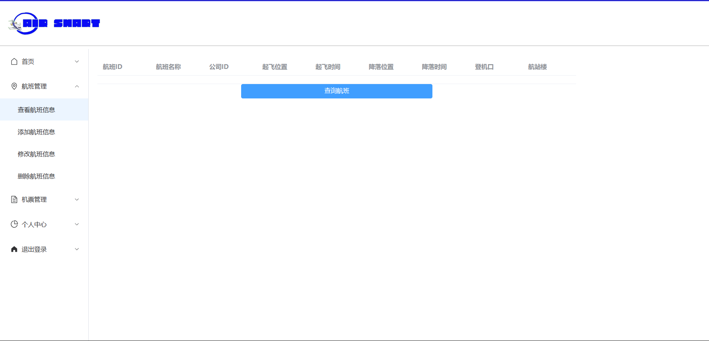
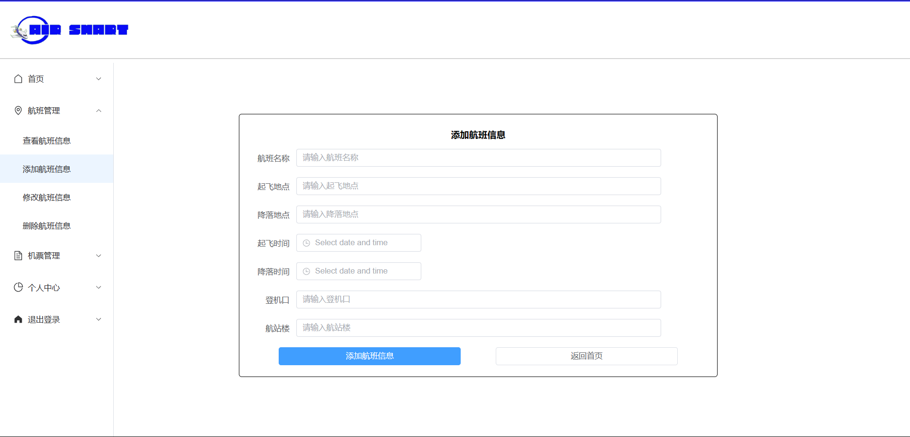
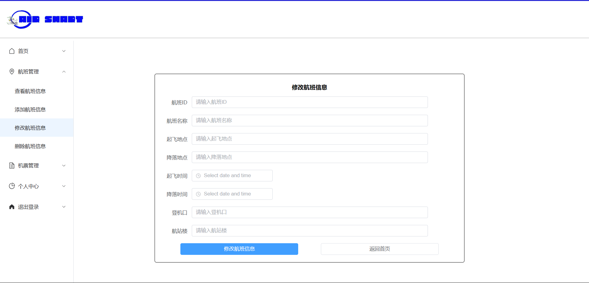

# 《智慧机场系统》用户使用说明书

[TOC]

## 一、引言

### 1.1 项目背景

随着旅游业的蓬勃发展，机场的运营需求不断增加。为了更好地服务管理者、航司、旅客、商户和机场工作人员，需要一套智慧机场系统来管理和协调机场的各项工作。

本智慧机场系统主要的应用场景为在机场智能调度跑道资源，主要的目标是在限定跑道数目的情况下，在保证安全的情况下实现对航空公司发布的航班信息的智能调度，提升机场的效率。该软件主要优势在于可以自动对发布的信息进行审查，并为用户提供了良好的信息查询接口。

### 1.2 编写目的

为了让用户了解如何正确使用本平台，本文档对智慧机场系统进行详细的说明。

### 1.3 术语定义

[1] 游客：未注册的网站使用着，只具备注册功能，不具备其他任何功能。

[2] 用户：已注册的网站使用者，具有游客除了注册之外的所有功能，还可以对航班信息进行购买操作以及拥有订单管理的功能。

[3] 航空公司：已注册的航空公司，可以对自己公司的航班信息进行修改。

[4] 工作人员：已注册的机场工作人员，可以对机场设备进行报修以及负各种审核工作。

### 1.4 项目使用者

- 本平台的**最终用户**是希望通过本系统的辅助完成办理机场各项手续的旅客、希望在机场进行产品销售的商户以及希望借由本系统提供的相关信息提升工作效率的普通机场工作人员。
- 本平台的**系统维护人员**为项目开发团队，对于此系统的相关部分比较熟悉，团队内部具有对数据库、计算机、网络较为熟悉的人员。
- 本平台的**系统管理员**为负责上传、修改和更新航班相关信息的航司及负责各表单审批、导入和打印等相关操作的机场管理员（属于一类特殊的机场工作人员）。

[5] 商户：已注册的商家，可以在本平台售卖商品。

### 1.5 参考资料

[1] 吕云翔. 软件工程实用教程[M]. 北京：清华大学出版社, 2015.

### 1.4 相关文档

[1] 《软件开发计划书》

[2] 《需求规格说明书》

[3] 《软件设计说明书》

[4] 《软件实现说明书》

[7] 《项目总结表》

## 二、软件概述

### 2.1 项目目标

”智慧机场系统“的宗旨是为了方便用户查询航班和购买机票，让顾客不用亲自到机场，在线上也能享受机场的服务。

### 2.2 子系统介绍

本项目的子系统设置见下表

| 编号 | 名称             | 子系统功能描述                                               |
| :--- | ---------------- | ------------------------------------------------------------ |
| 1    | 机票管理系统     | 该子系统主要负责飞机信息的导入与修改，以及机票的售卖         |
| 2    | 用户管理系统     | 该系统主要负责用户的注册、登录、修改个人信息等，以及与用户相关的沟通客服、查看行李、购买机票等 |
| 3    | 工作人员管理系统 | 该系统主要负责管理工作人员登录、注册、添加保修信息、修改保修信息、查询报表、审核商户入住请求等 |
| 4    | 商户管理系统     | 该系统主要负责商户的相关工作，包括入驻申请、注册、登录、修改个人信息、管理商品等。 |

### 2.3 功能模块介绍

本系统功能模块见下表。

| 编号 | 名称                     | 模块功能描述                             |
| ---- | ------------------------ | ---------------------------------------- |
| 101  | 添加航班信息             | 负责航空公司添加航班信息                 |
| 102  | 删除航班信息             | 负责航空公司删除航班信息                 |
| 103  | 添加机票信息             | 负责航空公司在添加航班信息后添加机票信息 |
| 104  | 航空公司注册             | 负责航空公司的注册                       |
| 105  | 航空公司登录             | 负责航空公司的登录                       |
| 201  | 用户注册                 | 负责用户的注册                           |
| 202  | 用户登录                 | 负责用户的登录                           |
| 203  | 用户修改个人信息         | 负责用户修改个人信息                     |
| 204  | 用户沟通客服             | 负责用户与客服的交流                     |
| 205  | 用户查看行李信息         | 负责用户查看行李信息                     |
| 206  | 用户查询机票目录         | 负责用户查询机票目录                     |
| 207  | 用户购买机票             | 负责用户购买机票                         |
| 208  | 用户查询停车订单         | 负责用户查询停车订单                     |
| 209  | 用户添加停车订单         | 负责用户添加停车订单                     |
| 210  | 用户查询消息清单         | 负责用户对消息与通知的查询               |
| 301  | 工作人员注册             | 负责工作人员的注册                       |
| 302  | 工作人员登录             | 负责工作人员的登录                       |
| 303  | 工作人员审核商户入驻请求 | 负责工作人员对商户提交的入住请求的审批   |
| 304  | 工作人员添加报修请求     | 负责工作人员添加报修请求                 |
| 305  | 工作人员审核报修请求     | 负责工作人员审核报修请求                 |
| 306  | 工作人员查询财务报表     | 负责工作人员查询财务报表                 |
| 307  | 工作人员导入航班信息     | 负责工作人员导入航班信息                 |
| 308  | 工作人员添加行李信息     | 负责工作人员添加行李信息                 |
| 401  | 商户提交入驻请求         | 负责商户提交入驻请求                     |
| 402  | 商户注册                 | 负责商户的注册                           |
| 403  | 商户登录                 | 负责商户的登录                           |
| 404  | 商户添加商品信息         | 负责商户添加商品信息                     |
| 405  | 商户查询商品信息         | 负责商户查询自身的商品信息清单           |

### 2.4 性能介绍

具体性能需求点见下表。

| 编号 |    性能需求来源名称    |                使用者                |                  功能描述                  |                      输入                      |                响应要求                |          结果          |
| :--: | :--------------------: | :----------------------------------: | :----------------------------------------: | :--------------------------------------------: | :------------------------------------: | :--------------------: |
|  1   |        用户数值        | 游客，用户，航空公司，工作人员，商户 |               用户使用本平台               |                       无                       |                1000以上                |     平台使用无负担     |
|  2   |      接收信息类型      |    用户，航空公司，工作人员，商户    |            数据库接受的信息类型            |                      信息                      | 应当能接受文本、数值与图片等类型的数据 |     数据库接受信息     |
|  3   |       注册、登录       | 游客，用户，航空公司，工作人员，商户 |            使用本平台注册和登录            |                 注册和登录信息                 |                  0.5s                  | 输出注册成功和登录成功 |
|  4   |      航班信息查询      |            用户，航空公司            |            在数据库查找相应航班            | 航班相关信息（如起飞降落地点、日期、航班号等） |                   1s                   |   输出符合要求的记录   |
|  4   |      订单信息查询      |                 用户                 |            在数据库查找已购机票            |            订单相关信息（如订单号）            |                   1s                   |   输出符合要求的记录   |
|  5   | 信息的录入、修改、删除 |    用户，航空公司，工作人员，商户    |     在数据库中录入、修改、删除相应信息     |                  输入各种信息                  |                   1s                   |      输出提示信息      |
|  6   |    检查信息的规范性    |    用户、航空公司、工作人员、商户    |     检查录入、修改、删除的信息的正确性     |                  输入各种信息                  |               0.1秒以内                |  输出信息是否符合规范  |
|  7   |      财务报表输出      |               工作人员               | 在数据库查找相应的财务记录并以报表形式输出 |                       无                       |                   1s                   |        输出报表        |

## 三、运行环境

### 3.1 硬件运行环境

处理器：Intel(R) Core(TM) i7-10750H CPU @ 2.60GHz   2.59 GHz

内存：16GB

硬盘容量：1TB

输入输出设备：鼠标、键盘、显示屏

网络设备：宽带

### 3.2 软件运行环境

操作系统：Windows 10

连接的后端数据库：MySQL 8.0.13

项目运行环境：Java 11

浏览器：Google Chrome

## 四、系统各页面进入方式

### 4.1 本地文件进入方式

由于本项目使用Vue框架进行开发，所以只需要在项目目录运行npm run dev指令，运行成功后访问http://localhost:8080即可访问项目文件。

1. 主页面
   http://localhost:8080/

2. 登陆页面
   http://localhost:8080/#/login

3. 注册页面
   http://localhost:8080/#/register

4. 航空公司主页面
   http://localhost:8080/#/company

5. 航空公司查看航班信息页面
   http://localhost:8080/#/company/checkflight

6. 航空公司添加航班信息页面
   http://localhost:8080/#/company/addflight

7. 航空公司修改航班信息页面
   http://localhost:8080/#/company/changeflight

8. 航空公司删除航班信息页面
   http://localhost:8080/#/company/deleteflight

9.  航空公司查看机票信息页面
    http://localhost:8080/#/company/checkticket

10. 航空公司添加机票信息页面
    http://localhost:8080/#/company/addticket

11. 航空公司修改机票信息页面
    http://localhost:8080/#/company/changeticket

12. 航空公司删除机票信息页面
    http://localhost:8080/#/company/deleteticket

13. 用户主页面
    http://localhost:8080/#/tourist

14. 用户实名信息管理页面
    http://localhost:8080/#/tourist/touristSelfInformation

15. 用户机票管理页面
    http://localhost:8080/#/tourist/ticketmanage

16. 用户停车订单管理页面
    http://localhost:8080/#/tourist/ordermanage

17. 用户商品订单管理页面
    http://localhost:8080/#/tourist/purchasemanage

18. 用户个人中心页面
    http://localhost:8080/#/tourist/selfmanage

19. 工作人员主页面
    http://localhost:8080/#/admin

20. 工作人员停车位管理页面
    http://localhost:8080/#/admin/parkingManage
    
21. 工作人员行李信息管理页面
    http://localhost:8080/#/admin/luggagemanage
    
22. 工作人员申请管理页面
    http://localhost:8080/#/admin/applymanage
    
23. 工作人员个人中心页面
    http://localhost:8080/#/admin/selfmanage
    
24. 商户主页面
    http://localhost:8080/#/merchant

25. 商户商品管理页面
    http://localhost:8080/#/merchant/goodsmanage

26. 商户商品订单管理页面
    http://localhost:8080/#/merchant/ordermanage
    
27. 商户个人中心页面
    http://localhost:8080/#/merchant/selfmanage

## 五、系统功能使用说明

### 5.1 游客未登录主页面

#### 5.1.1 包含内容

1. 导航栏：可以跳转到其他的页面。

#### 5.1.2 功能介绍

1. 导航栏跳转

   由于各页面导航栏功能一致，所以我们将导航栏功能放在此说明，之后便不再进行赘述。

   - 点击“登录/注册”会跳转到登录页面，用户可以进行登录或注册。
   - 点击机票可以进行机票查询
   - 点击首页能回到主页面

### 5.2 登录和注册页面

通过此页面进行登录注册。

#### 5.2.1 包含内容

1. 导航栏：可以跳转到其他的页面。
2. 登录框：可以通过登录框进行登录。
3. 注册框：如果游客没有账号，可以进行注册。

登录页面如下图：

#### 5.2.2 功能介绍

1. 输入邮箱和密码之后，如果存在对应用户，则会登录并返回到主页面。如果不存在则会返回错误。

2. 点击注册会弹出注册框，可以在注册框进行注册，注册信息合法则注册成功，否则会返回注册失败。

   注册框如下图：

   

### 5.3 航空公司模块页面

航空公司可以查询，修改和删除航班和机票信息。

#### 5.3.1 包含内容

1. 导航栏：可以跳转到其他的功能。
2. 航班管理：查看、添加、修改、删除航班信息。
3. 机票管理：查看、添加、修改、删除机票信息。

#### 5.3.2 功能介绍

1. 航班管理
   - 查看航班信息可以查询该公司发布的航班
   - 添加航班信息可以添加该公司航班
   - 修改航班信息可以修改该公司已发布的航班
   - 删除航班信息可以删除该公司已发布的航班
2. 机票管理
   - 查看机票信息可以查询该公司发布的机票
   - 添加机票信息可以添加该公司机票
   - 修改机票信息可以修改该公司已发布的机票
   - 删除机票信息可以删除该公司已发布的机票

3. 个人中心
   - 修改密码和个人信息

4. 退出登录
   - 退出登录并返回主页面

下列图片为航班管理模块部分页面展示：
- 查询航班信息
  
- 添加航班信息
  
- 修改航班信息
  
- 删除航班信息
  

### 5.4 用户模块页面

#### 5.4.1 包含内容

1. 导航栏：可以跳转到其他的页面。
2. 实名信息管理：查看、添加、修改、删除实名信息。
3. 机票管理：查询、购买机票。
4. 停车订单管理：查询、添加、退订停车订单。
5. 商品订单管理：查询、订购商品。
6. 个人中心：修改账户信息。

#### 5.4.2 功能介绍

1. 实名信息管理
   - 查看用户实名信息
   - 添加用户实名信息
   - 修改用户实名信息
   - 删除用户实名信息
2. 机票管理
   - 查询指定航班信息
   - 查询指定航班机票
   - 购买机票
   - 列出已购买机票
   - 退票
   - 列出机票空闲座位
   - 选择机票座位
3. 停车订单管理
   - 查询停车位
   - 添加用户停车订单
   - 查看用户已添加停车订单
   - 退订已添加停车订单
4. 商品订单管理
   - 列出已入驻商户
   - 列出指定商户用品
   - 订购商户拥有的商品
   - 退订已订购商品
   - 查看已有订单
5. 个人中心
   - 修改邮箱
   - 修改密码

以下为用户模块部分页面展示：
- 添加实名信息

- 查询指定航班信息

- 修改邮箱

### 5.5 工作人员模块页面

#### 5.5.1 包含内容

1. 导航栏：可以跳转到其他的页面。
2. 停车位管理：查看、添加、修改、删除停车位信息。
3. 行李信息管理：添加、更新和删除行李信息。
4. 申请管理：添加、查看和删除报修申请；查看入驻申请和查看财务报表。
5. 个人中心：修改账户信息。

#### 5.5.2 功能介绍

1. 停车位管理
   - 添加停车位信息
   - 查看已添加停车位信息
   - 修改停车位信息
   - 删除停车位信息
2. 行李信息管理
   - 添加用户行李信息
   - 更新用户行李信息
   - 删除用户行李信息
3. 申请管理
   - 添加报修申请
   - 查看已添加报修申请
   - 查看商户入驻申请
   - 删除报修申请
   - 查看财务报表
4. 个人中心
   - 修改邮箱
   - 修改密码

以下为工作人员模块部分页面展示：
- 添加停车订单
   
- 添加行李信息
   
- 添加报修申请
   

### 5.6 商户模块页面

#### 5.6.1 包含内容
1. 导航栏：可以跳转到其他的页面。
2. 商品管理：查看、添加、修改、删除商品信息。
3. 商品订单管理：查看已有订单。
4. 个人中心：修改账户信息。
   
#### 5.6.2 功能介绍
1. 商品管理
   - 查看商品信息
   - 添加商品信息
   - 修改商品信息
   - 删除商品信息
2. 商品订单管理
   - 查看已有订单
3. 个人中心
   - 修改邮箱
   - 修改密码

以下为商户模块部分页面展示：
- 添加商品信息
   
- 修改商品信息
   
- 查看已有订单
   